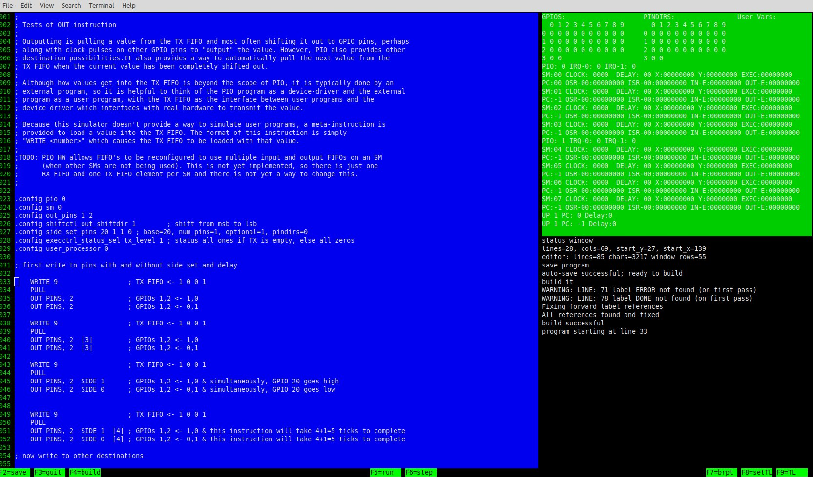
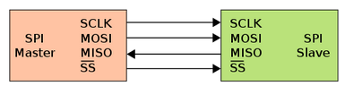
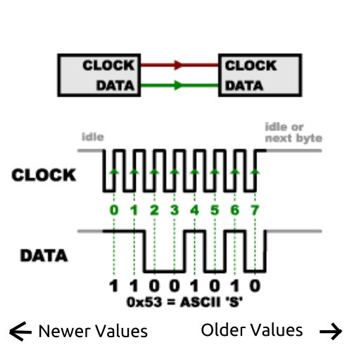
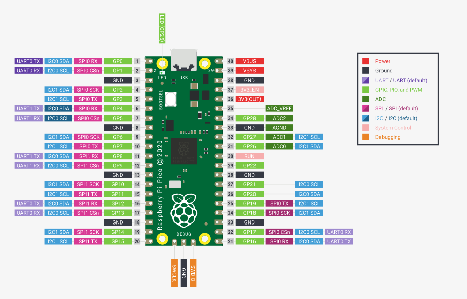
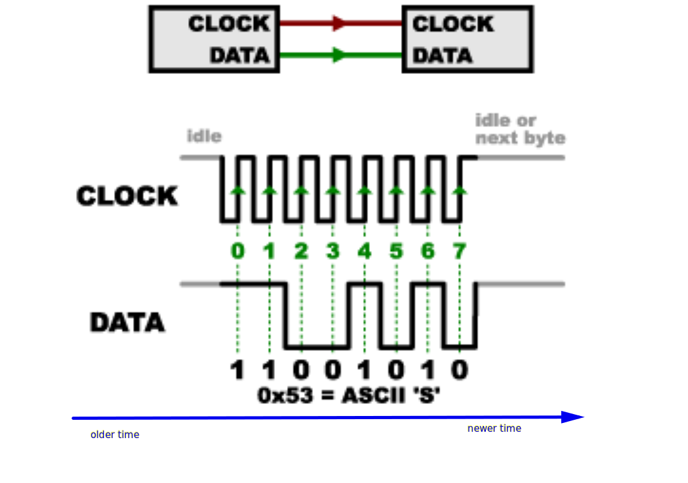
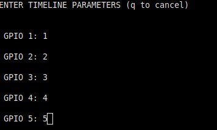
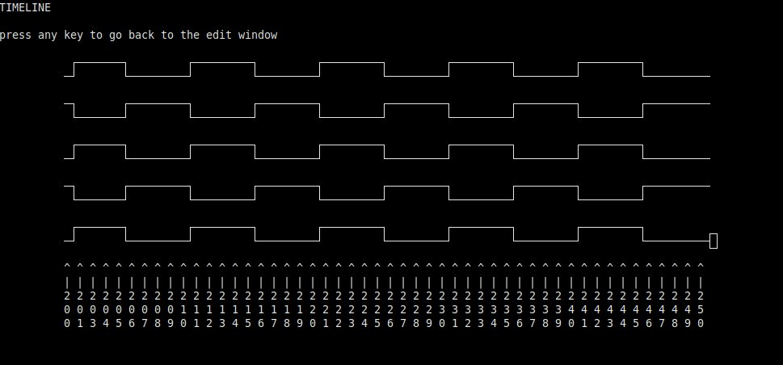

# Simpio: Learning PIO Programming the Easy Peasy Way

copyright David Hamilton 2023

## Getting Started - The Simpio User Interface

To get started, download the simpio executable and invoke it on a command line with an input PIO program file, e.g., 

>./simpio test.simpio

*It is helpful to ensure that the terminal window you are using is full-screen before invoking this. The screen should look similar to the one below:*



> TIP: if the hardware summary in the top right is not displayed as in the above, try reducing the font size in the terminal properties so that more characters can be displayed.

The result of this will be a screen showing:

- The input program file on the left (aka the editor window)
- The right hand side split into an upper part that will show PIO hardware state (aka the regs window) and a lower part that has information messages (aka the status window). There will be more on the regs window later when PIO hardware elements are explained.
- A single line at the bottom reminding one of key function keys for saving, building, running, stepping, and setting breakpoints.

One can edit the program file in this window using the PgUp, PgDown, arrow and backspace keys in addition to typing characters into the file. However, the editor features are extremely basic and intended for making simple changes like fixing syntax typos. It is recommended that new PIO programs be developed using a separate text editor.

The editing changes can be saved by pressing PF2. However, while in beta, Simpio saves all changes to temporary file so that the original program is never altered. It is from this temporary file that the program is compiled from. If one wants to save the edited changes, one can copy the contents of the temporary file ("temp_pio_file") to the desired file outside of Simpio.

The typical workflow is to press PF4 to compile the program and then repeatedly pressing PF6 to step through it one line at a time. If there are syntax errors in the program and it fails to compile correctly, there are currently very limited error messages. Currently, the best way to understand syntax errors is to run it without the user interface like this:

> ./simpio sd test.pio

In this special "syntax details" mode, full parsing debug messages are displayed. This will produce a lot of output showing each line as it is being tokenized and parsed. It will show you exactly where something went wrong and it bit about what was expected instead. 

*PIO statements are pretty simple, so debugging syntax errors isn't usually that big of a deal.*

On can also move the cursor key to any line containing a PIO instruction and press PF7 to set a breakpoint (pressing PF7 again on a line clears the breakpoint so PF7 is actually the breakpoint "toggle" key). After setting breakpoints, one can press PF5 to run the program until it encounters the first breakpoint. If your program is stuck in loop, running forever and not hitting a breakpoint, then you can break out of the run mode by pressing the 'b' key. (to "break" out of run mode)

While stepping through a program, one can track what is going on by watching the upper left window (the regs window). However, it is hard to see the "big picture" of what the program is actually doing this way. A better way to see the big picture with PIO programs is the GPIO timeline view. Pressing PF8 displays a dialog showing up to five GPIO pins that can be selected. Type in a number to input a selected GPIO number, using the tab key to move through the various GPIO input fields. When done, press enter once to see a summary of the selection, and then enter once again to lock in those selections and return to the editor window. After selecting the GPIOs, pressing PF9 will display a timeline view of how those GPIOs changed over time. If the program ran longer than the timeline view will accommodate, then only the last 50 or so clock cycles will be shown. More on the timeline view will be discussed later.

When done, press "q" to exit Simpio. If anything really bad happens then one can just abort out of the whole thing by closing the terminal window. This won't hurt anything and Simpio can be started in a new terminal window afterward without any problem. 

In summary (as a quick reference):

- View and edit the current file on the left side using arrow keys, PgUp, PgDown, backspace, and typing new characters.
- View the current state of the PIO hardware in the upper left, noting anything that is highlighted which calls out what changed.
- View status messages, such as success/failure of compiling the program in the status window on the lower right side.
- PF2 to save changes to the program  (to temp_pio_file).
- PF4 to build/compile the program. 
- PF6 to step through the program one line at a file.
- PF7 to toggle a breakpoint on the line pointed to by the cursor.
- PF5 to run a program until the next breakpoint
- Press the 'b'  key to break out of a program that isn't stopping on its own
- PF8 to select GPIOs to display a timeline for.
- PF9 to display a timeline.

## Simpio Options

There are a few command line options for other ways to use Simpio. The options are best explained by looking at why one would want to use them.

### Interactive Mode - No UI

If user interfaces are not to one's liking or one has too small a display/resolution to take advantage of it, then there is an interactive mode that can be invoked by providing the i option:

```
./simpio i test.pio
```

This will immediately syntax check the pio program file, build it, and be ready to start execution at the first instruction. From this point, a few commands can be entered on the command line / terminal.

- Entering the character 's' and return will single step the program; this can also be done by simply hitting enter without the explicit s/single-step command. Simplio will print a message summarizing the result of executing that command and then print the next line to be executed.

- Entering the character 'b' immediately followed by a line number will toggle a breakpoint on that line number.
- Entering the character 'r' will run the program until it encounters a breakpoint. During execution, messages will be printed explaining the results of execution.
- TBD: there are not yet commands to inspect the current state or set watchpoints for various GPIO pins or PIO state machine data.

### Debugging Syntax Problems

If the messages printed to the user interface about syntax-checking or build problems do not provide enough information, then one can get more detailed information by typing:

```
./simpio sd test.pio
```

This will print the process of processing each line and token (word or symbol) in the pio program file, including messages about any unexpected item that is encountered or is missing. These messages will be most useful when used along with the grammar rules in simpio.y.

### Controlling Amount of Execution Messages

By default, simpio prints minimal messages during execution, relying on the regs window to show what is happening. When using the user interface, a little more messaging can be suppressed shown along with the UI by starting it with the ui options (u=ui, i=info messages):

```
./simpio ui test.simpio
```

If even more messaging is desired then full detailed messaging can be shown by starting it with the ud options (ui plus detailed messages):

```
./simpio ud test.pio
```

And detailed messages can also be printed in interactive mode too:

```
./simpio id test.simpio
```

### Test Mode

There is also a test mode (t option) that runs the program interactively and if it ends on the last line in the file, then the test is considered successfully run. This for simpio development and regression testing.

## Introduction - What PIO Programming is All About

### Device Drivers & Bit Banging

For those familiar with device drivers, that is really what PIO programs are. A device driver is software that typically runs as part of an operating system or at a low level in an embedded system. Device drivers communicate with (or "drive") hardware using a bus, I/O lines, or some other bit of communication hardware this is built-in or attached directly to the main computer chip in the system. For this introduction, one doesn't need to know anything about buses or other communication hardware because PIO programs are focused one one simple mechanism which is  changing the high/low state of GPIO pins. These pins are exposed on the Pico chip and electrically connected to some pins on the device being driven (via wires, PCB traces, etc. - how they are electrically connected isn't important). These pins could also be connected to another computer chip in a multi-processor system, like an automobile that can contain dozens of computer chips that each control one part of the automobile and all communicate with each other to run the car, show status on the display, etc. PIO instructions are just about flipping GPIO pins high and low, but doing this quickly and efficiently with predictable timing. 

This sort of programming is often referred to as "bit banging" because some software is changing a bit (high/low value) many many times (banging it) in order to communicate a small amount of information with really cheap simple hardware. In addition working with cheap hardware, bit banging from a software program means that communication protocols can be changed by just changing the bit banging software. Bit banging is what PIO programming is all about.

### Serial Wire Protocols

An automobile is actually a good example to keep in mind because they generally use the same communication protocols that PIO programming is designed for. These are simple serial protocols that involve (quickly) flipping a small number of GPIO pins (e.g, two or even one!) high and low in a certain sequence with certain timing constraints to send commands and responses between computer chips. 

### Serial Peripheral Interface - SPI

It is helpful to briefly look at a real serial wire protocol as an example. Serial Peripheral Interface is a serial protocol anyone with a basic understanding of electronics would probably design if they were asked to come up with a way to communicate bi-directionally between two devices using a very small number of on each side. An intuitive approach is to use one pin for data that is to be read, another pin is used for data that is to be written, and a third pin tells each device when data is available to be read. So there are two data lines and one so-called "clock" line. 

**Note: when using GPIO pins to communicate, it is important to understand that GPIO pins do not change from high to low or low to high instantly, especially when connected to something over a wire of some length. There is some period of time before the pin and the wire it is connected to to absorb or discharge enough electrical energy to become high or low. A good analagy to keep in mind is three children playing jumprope. Two children hold the rope, one on each end of the rope and they spin the rope around, up, around the other side, back down, and repeat this motion. The third child is in the middle, jumping up and down so that the rope goes below and above them without hitting them. The child in the middle must synchronize their jumping so that they are up when the rope is down and down when the rope is up. The child in the middle looks at one of the other children to understand the timing of the rope going up and down so they can synchronize their jumping with the motion of the rope. Synchronous protocols work like jumping rope, where the voltage on the wire/pin going up & down is like the rope going up & down and where the clock signal is like the children at each end that show the timing of the rope going up & down (indicating the timing of the signal, so the read happens when the signal is in the right state and stable enough to be read).*


"Designed by Freepik" (www.freepik.com)

Before looking at what each pin does, it is helpful to look at some terminology. Calling something a "write line", for example, is bit ambiguous because each data line is written to by one device and read from by the other device. To make this clearer, one side of the connection is called the master and the other side is called the slave, and then one of the lines is called the Master Output Slave Input  (MOSI) and the other data line is called the Master Input Slave Output (MISO), resolving the ambiguity. The Master is in charge of driving the clock high and low; the slave just watches the clock line. So the Master is like the child turning the jump rope and the slave is like the child jumping the rope.

SPI also includes one more line called the Slave Select (SS) line. This is used when multiple Slave devices are connected to one Master. The Master can use multiple Slave Select lines to select which slave it wants to talk to at a given time. 



 (picture from 

[Wikipedia}\)]: https://en.wikipedia.org/wiki/Serial_Peripheral_Interface

When sending data from the Master to the Slave, the Master sends data one bit at a time, starting with the Most Significant Bit (MSB) first. The following picture from a Sparkfun article on SPI shows sending the ASCII character capital S.



https://learn.sparkfun.com/tutorials/serial-peripheral-interface-spi/all

There are several important points to note from the above picture:

- Time moves from left to right. It can be helpful to think of how it might look if values were displayed in real time as they are happening. The values would begin to appear on the left and as time goes on, they move to the right, so that the older values are always on the right side and the newer values are on the left. 
- The green arrows pointing up on the clock signal (when the clock goes from low to high) are when the device reading data should read what is on the data line. The dotted line going down to below the data line shows the value that would be read.
- The numbers in green on each dotted line indicate the bit number that would be read, for an 8 bit value. Bit 7 comes across first and bit 0 comes across last. So the 8 bit byte value read in the above diagram would be 0101 0011, which is 53 in hex, and the ASCII table shows that 53 hex corresponds to the capital letter 'S'. 

### Other Protocols

 Because the design of SPI is fairly intuitive, it is probably tempting to think that all serial protocols work like it does, so it may be helpful to briefly look at different approaches to dissuade this thinking.

- Some protocols do not have a clock signal to indicate when to read a value. Such asynchronous protocols include something in the data signal that provides information to each side to periodically synchronize their own independent clocks that they then use to know when to read a value. A good example of this type of protocol is RS232.
- Some protocols have only one data line that each side uses to both read and write data. These protocols have various mechanisms to prevent multiple devices that are sharing this common data line from trying to write to it at the same time. A good example of this type of protocol is 1-wire which. The hardware for 1-wire includes a common voltage source that pulls the shared line up to a high value through a weak resistor. Any client that shares this line can pull it low by draining the voltage from the line faster than it can be supplied through that weak pull-up resistor. This provides a way for any client to write to the line at any time and all other clients to simultaneously read the value of the line (high or low). There is one designated Master device that is responsible for writing a value on this line known as a "reset pulse" and writes a command value to the line which indicates which slave device should then write a response to the common line. All slave devices continuously read the line to know what is going on and look for commands that they should respond to.
- Of course some protocols are not completely serial. Some use 8 lines to send an 8 bit value, sending all bits simultaneously. These are known as parallel interfaces as opposed to serial ones.
- Some communication protocols use two lines instead of one to send each bit of information. This eliminates the need for each device communicating to rely on a common electrical ground that the signal lines high and low states are relative to. These so-called differential signally approaches can detect very tiny voltage differences between the two lines for each bit. Tiny voltages can be generated much faster than larger voltages on the normal so-called "single ended" signaling like in the rope-jumping analogy. This means that so these differential signally approaches are much faster and tend to use much more sophisticated rules to communicate data between devices. A good example of this is PCI-express now used ubiquitously in modern high-speed desktop and server computers.

### Basic Concepts

In addition to a basic understanding of communication protocols, there are a few basic concepts that are helpful to understand before diving into PIO programming. There will be more detail on each of these areas during the section on PIO programming.

#### Shifting

Few systems can do much with one bit values. They almost always rely mostly on 8, 16, or 32 bit values. Since translating these values into a series of bits and translating a series of bits back into these values involves significant processing, there is usually special hardware to handle this much faster than a computer program could do it. This special hardware involves the use of special registers called Shift Registers. The Pico chip includes such hardware, using these special shift registers is integral to PIO programming, and will be discussed in more depth later.

#### Pin/GPIO Naming, Numbering, Indexing

Communication between computer chips involves some using of I/O pins on each chip. These pins actually involve quite a bit of electronics and can be configured to work a bit differently (like the weak pull-up resistor discussed earlier). The main thing to know initially is that they can be configured to be read-only or writable.

Another important thing about the pins is how they are named. Each board used will have a "pinout" diagram showing which physical pins on the board correspond to which internally used "GPIO" (General Purpose Input Output) names, such as the following one for the official Pico board from the Raspberry Pi website:



Note that each physical pin has a number, starting with pin number 1 at the top left, going down to pin number 20 on the bottom left, then continuing at pin number 21 on the bottom right and finally going up to pin number 40 on the top right. The pin numbering could be different between different boards, so it is often better to refer to them by a different name that does not change from board to board. Each pin actually has multiple names, depending on what it is to be used for, but for PIO programming purposes the key name is the general purpose "GP" (or GPIO) names - GP0, GP1, etc. One can think of these GP names as being absolution (never changing) because there is another naming system that is relative to a base GPIO. For example, if the base is 5 then the number 3 would refer to GP8 in relative GP naming (or indexing). There is one last naming convention which is a base plus another index number to mean *all* the GPIOs starting at the base up to including the GPIO base+index. Keeping GP naming straight in one's mind during PIO programming is very important and kind be a bit challenging because there are different groups of GPIOs (input, output, set, side-set) that each have their own base and in different contexts could be refer to a GPIO using an absolute name or one relative to a base for that group that is configured separately from the PIO program, or in some contexts could refer to a whole set of GPIOS in a range. This will be discussed in more detail later, but GPIO naming is an important concept to be aware of.

#### User Level Programs and FIFOs

PIO programs only handle communication. They generally don't do anything with the bytes being communicated other than sending and receiving them. The software that use those bytes are referred to as user level programs, and on the Pico processor these programs run in one of two ARM processors that execute independently of the processors that PIO programs execute in. The mechanism which allows those bytes to go from user level programs to PIO programs and back again involves the use of First-In-First-Out buffers. As the name implies, the first things that go into these buffers is the first thing to come out of them.

One FIFO is used for sending data from user programs to PIO programs, and is called the TX FIFO and a different FIFO, called the RX FIFO, is used to send data back the other way. The process works like this:

- When a user program wants to send data, it makes a function call that is part of the Pico SDK. This function call ensures that the FIFO is not currently being used by the PIO hardware and then it puts the data value passed to it onto the FIFO if there is room. If there isn't room then it either returns an indication that the value couldn't be written or it blocks, depending on how the user program wants it to behave.
- Depending on the size of the FIFO, the user program may repeatedly call the SDK function to put more data into the TX FIFO. 
- Some time later a PIO program will "pull" a value from the TX FIFO. This puts the value into a special register called the Output Shift Register, or OSR. The PIO program will then do a series of write instructions, each wite instruction causing PIO hardware to extract bits from this OSR register and drive GPIO pins based on the bits extracted. The number of bits extracted, whether they start at the MSB (most significant bit-the one that makes the binary number much bigger) or LSB (least significant bit-the one that adds just one to the binary number), and which GPIO pins are driven are all specified in the configuration of a PIO program (more on this later).
- When the PIO program issues a series of input instructions, this causes bits to be configured in a special register called the Input Shift Register (ISR) based on values of specified GPIO pins. When the required number of bits have been set in the ISR, the value is the put into a RX FIFO by the PIO program by executing a push instruction. 
- Whenever the user program makes a call to another Pico SDK function to read a value, that function will get a value from the RX FIFO if there is one and when the PIO hardware isn't using this same FIFO at the same time.  

*The Most Significant Bit (MSB) is the one that is on the left as a value is written in binary on paper for a human to read. The Least Significant Bit (LSB) is the one on the right. So, for example, the letter 'S' in ASCII is the decimal number 123 which is 53 in hex, or 0101 0011 in binary. The MSB in this value is a zero and the LSB is a one.*

So data goes from user program to PIO program through a TX FIFO and back through an RX FIFO. In between, the PIO uses pull and push instructions to get data into and out of these FIFOs into shift registers that help twiddle GPIO pins the right way at the right time to communicate the values over I/O lines.

## Part 1 - Anatomy of PIO Programs 

The previous section provided some important basic concepts. This section begins to delve into actual PIO programming by describing their basic structure. Later sections will discuss more about  PIO instructions.

Comments are begun by the semicolon character and continue until the next line. It is usually a good idea to start a PIO program with several lines of comments about the program.

Following the introductory comment block is a series of configuration statements, including an indication of which PIO, state machine, and user processor is being used. There are two PIO hardware blocks in the Pico microcontroller and each PIO contains four state machines. That means that a total of 8 PIO programs could run concurrently. In addition to the eight state machines, there are a couple of user processors running user programs. The statements following the configuration block will be loaded into the selected pio, state machine (sm) and user processor, for example:

```
.config pio 0
.config sm 0
.config user_processor 0
```

*Currently only two user processors are supported, which is enough to simulate two devices talking to each other, e.g., one user processor running a master user program and the other acting as a slave.* 

*All ".config" statements in Simpio are unique to Simpio. Real Pico PIO programming involves writing a program in C that writes specific values to special registers. However, the config statements in Simpio are intended to be a direct mapping of configuration registers to make the transition process a bit easier. In other words, the same configuration values are used; it is just that the mechanism is config statements rather that C programming language assignments.*

User programs read and write data to and from PIO programs using variables. For example, a user program may read a value from the RX FIFO. This value needs to go somewhere, so it goes into a user variable. User variables need to be declared in a configuration block and then can be referenced by user statements in the program that follows, for example:

```
.config user_var A
```

There are several other configuration statements that customize the behavior of PIO instructions. These will be discussed later as various PIO instructions are discussed.

Following the block of configuration statements is an actual PIO program, composed of both PIO instructions and user instructions. There are two basic styles that can be used. The first is to put all user instructions together and then all PIO instructions together. The other style is to intermix user and PIO statements that logically go together. The examples provided use the second style.

Regardless of which style is used, Simpio alternates between running user instructions and PIO instructions, so when single stepping through a PIO program, one will see a bit of jumping back and forth between user and PIO instructions that may be a little surprising at first but it is inherent in the multi-processor nature of PIO programming and actually serves to help one understand the multi-processing nature better.  

## Part 2 - Basic Reading and Writing

### Overview

Although there are many different sources and destinations possible for most of the PIO instructions, the most common and basic approaches are:

1. read a value from pins by shifting bits represented by pin high/low values into the ISR, then push the ISR to the RX FIFO where a user program reads the value
2. write a value from a user program to the TX FIFO where it is pulled into the OSR and then written to pins by shifting bits from the OSR to drive pin high/low values.

When first learning PIO programming, the above two statements probably contain way too many acronyms and concepts to grasp the first time reading them. The rest of this section will go through each of the above slowly with careful explanation of all terms along with example programs that can be stepped through one statement at a time using Simpio to understand exactly what is happening.

### Basic Reading

The most common basic steps for reading a one byte value are:

1. read the value of a specified pin 
2. based on the value of the pin, shift one bit into the Input Shift Register (ISR)
3. continue reading the pin and shifting bits into the ISR until all 8 bits of the byte have processed
4. push the value from the ISR into the RX FIFO, where it can wait until a user program reads it
5. read the (next) value from the RX FIFO into a user variable

*Steps 1-4 are accomplished using PIO instructions, and step 5 is accomplished using a user instruction.*

#### Reading Pins

Reading GPIO (pin) values is accomplished using the IN instruction. One might think that this instruction would take a pin number as an argument, but which pin(s) to read is actually specified using a configuration statement:

```
.config in_pins 1
```

"in_pins" indicates that this configuration statement is for input pins. There is a separate config statement to specify which  pins to use for output. The first numeric argument says what is the starting, or base, pin. 

Given the above config statement, the following IN statement:

```
        IN PINS,2
```

says to read the values of pins 1 & 2 and shift this value pair into the ISR.

Shifting can happen either "to the right" or "to the left" and what this means is a little different between input and output:

- Outputting one bit "to the right": 
  1. The least significant bit (the one conceptually on the right) is used to set the output pin
  2. The output shift register (OSR) is shifted one bit to the right so that the bit just used for output "falls off" and the new bit to output is loaded into the least significant bit of the OSR.
- Inputting one bit to the right:
  1. The input pin is read to get the input bit value
  2. The input shift register (ISR) is shifted one bit to the right, creating a "gap" on the left
  3. The value read from the input pin is copied to the gap created on the left

So output to the right happens on the right side of a binary value, while inputting to the right happens on the left side. If this is a bit confusing, or seems backwards, it might help to mentally think about "to the right" meaning exiting to the right and entering on the left but moving to the right, but in both cases, the movement of bits when shifting is always "to the right". And of course, to the left is the opposite - bits exit on the left and enter on the right but move to the left.

The above is when just one bit is input or output at a time, but it is possible to input and output multiple bits on multiple GPIO lines at the same time. There are a couple of ways this could have been done:

1. Simply repeating the same operations that would be happen if things were done one bit at a time. For example, inputting from GP0...GP7 at the same time would be identical to inputting from GP0, then GP1, etc. up to GP7.
2. Taking the value of the input as a binary number and copying it to the bits in the shift register in the same order, regardless of the shift direction.

The key difference between the above two schemes is in how the multiple bits wind up being ordered. Since the RP Pico uses the second scheme above, it is worth looking at this more closely. First note that when reading a value from, for example, GPIOs GP0, GP1, and GP2, that is 1, 1, and 0, this could be the binary number 110 (decimal 6) or it could be the binary number 011 (decimal 3). The second way (011) is how the Pico does it. It is helpful to think of higher numbered GPIOs being more significant. Given this, the following is how 3 bits are output and input:

- Outputting 3 bits "to the right": 
  1. The number corresponding the 3 rightmost bits is copied to the 3 GPIOs. For example, if the 3 rightmost bits are 011 and the output pins are GP0, GP1, and GP2, then GP0 is set high (one), GP1 is set hight (one) and GP3 being the most significant one is set low (zero). 
  2. The output shift register (OSR) is shifted 3 bits to the right so that the 3 bits just used for output "fall off" and the next 3 bits are each moved 3 places to the right so that they are in place for the next output.
- Inputting 3 bits to the right:
  1. The 3 input pins are read to get a binary number, for example 011.
  2. The input shift register (ISR) is shifted 3 bits to the right, creating a new 3 bit "gap" on the left
  3. The value read from the input pin is copied to the gap created on the left. For example, if 011 is read from the input pins then the leftmost 3 bits of the ISR would be set to 011, in that order.

And just to ensure this is all clear, here is the operations when things are "to the left":

- Outputting 3 bits "to the left": 
  1. The number corresponding the 3 leftmost bits is copied to the 3 GPIOs. For example, if the 3 leftmost bits are 011 and the output pins are GP0, GP1, and GP2, then GP0 is set high (one), GP1 is set hight (one) and GP3 being the most significant one is set low (zero). 
  2. The output shift register (OSR) is shifted 3 bits to the left so that the 3 bits just used for output "fall off" on the left side and the next 3 bits are each moved 3 places to the left so that they are in place for the next output.
- Inputting 3 bits to the left:
  1. The 3 input pins are read to get a binary number, for example 011.
  2. The input shift register (ISR) is shifted 3 bits to the left, creating a new 3 bit "gap" on the right
  3. The value read from the input pin is copied to the gap created on the left. For example, if 011 is read from the input pins then the leftmost 3 bits of the ISR would be set to 011, in that order.

There are two general considerations to keep in mind when inputting and outputting bits and sending values to user programs via the FIFOs:

1. The order of bits
2. Where the bits wind up (on the left or on the right)

Generally, one wants the bits to end up in the same order and on the same side as they started out. When inputting and outputting a whole set of 32 bits (the size of the input and output shift registers), one can do this inputting and outputting both to the left or inputting and outputting both to the right. However, when doing less than 32 bits:

- If both output and input are to the right: the desired lower bits that were on the right of the output will wind up on the left of the input (but in the right order).
- If both output is to the right and and input is to the left: the desired lower bits that were on the right of the output will wind up on the right some of the input but will be in the opposite order.
- If both output and input are to the left: the desired lower bits that were on the right of the output won't be output but if they were then they would end up on the right in the input (and in the right order).
- If both output is to the left and and input is to the right: the desired lower bits that were on the right of the output won't all go out and will wind up on the right side in the opposite order.

So what is one to do?  There are two general approaches to ensuring that less than 32 bit transfers end up on the correct side and correct order:

1. Add more shifts, either before sending or when receiving. These can be done by either outputting the undesired leftmost bits to "null" before sending to the left or inputting addition bits from "null" when receiving bits to the right. "null" is a fictitious destination that results in throwing away what is sent to it and a fictitious source that results in zeros appearing at though they came from an input source. The first approach of outputting to null results in moving the desired bits to be output over to the left so they will be the only ones output. The second approach results in shifting the input bits to the correct side after they are all received.
2. Reorder the bits before sending or after receiving. There is a built-in operation in PIO programming to do this. So one can output to the right, input to the left, and then reverse the bit order in what was received.

Note that in the case of sending a whole block of bits all at the same time ("parallel I/O"), one can output to the right and input to the left with the bits ending up in the correct order without having to reverse them. This is because the bits are copied all together, rather than shifted one at a time.

Here is a more complete example of sending a byte one bit at a time. Suppose a PIO program reads the following values from GPIO pin 1: 

```
high then low then low then high then low then high then high then low
```

This corresponds to reading the following bit values:

```
one then zero then zero then one then zero then one then one then zero
```

or

```
1001 0110
```

When this series of values is shifted "to the right", the first bit IN causes the value in the 32 bit ISR the be:

```
1000 0000 0000 0000 0000 0000 0000 0000
```

If the first bit read was instead shifted "to the left", the value in the ISR would be:

```
0000 0000 0000 0000 0000 0000 0000 0000
```

The following shows the complete read sequence "to the right", where the number before the "=>" is the value read, and the value after "=>" is the value of the ISR:

```
1=>1000 0000 0000 0000 0000 0000 0000 0000
0=>0100 0000 0000 0000 0000 0000 0000 0000
0=>0010 0000 0000 0000 0000 0000 0000 0000
1=>1001 0000 0000 0000 0000 0000 0000 0000
0=>0100 1000 0000 0000 0000 0000 0000 0000
1=>1010 0100 0000 0000 0000 0000 0000 0000
1=>1101 0010 0000 0000 0000 0000 0000 0000
0=>0110 1001 0000 0000 0000 0000 0000 0000
```

And if the byte read needs to be on the left, then the following:

```
		IN NULL, 24
```

Would result in:

```
0000 0000 0000 0000 0000 0000 0110 1001
```


So if the ISR is pushed into the RX FIFO and read by a user program, the user program would read the 32 bit value: 6900000000000000 in hex, or 7566047373982433280 in decimal. By adding one additional OUT instruction from null:

```
		OUT null, 
```


And the following shows a complete read sequence "to the left":

```
1=> 0000 0000 0000 0000 0000 0000 0000 0001 
0=> 0000 0000 0000 0000 0000 0000 0000 0010 
0=> 0000 0000 0000 0000 0000 0000 0000 0100 
1=> 0000 0000 0000 0000 0000 0000 0000 1001 
0=> 0000 0000 0000 0000 0000 0000 0001 0010 
1=> 0000 0000 0000 0000 0000 0000 0010 0101 
1=> 0000 0000 0000 0000 0000 0000 0100 1011 
0=> 0000 0000 0000 0000 0000 0000 1001 0110 
```

And using the following to reverse the bit order:

```
		MOV ISR :: ISR
```

Would result in 

```
0000 0000 0000 0000 0000 0000 0110 1001
```

To configure input shifting to the left:

```
.config shiftctl_in 0 0 32
```

And to configure input shifting to the right:

```
.config shiftctl_in 1 0 32
```

> Note: the second and third arguments (autopush and push threshold) will be discussed later.

#### Binary and Hexadecimal (Hex) Numbers

By the way, if one is a bit new to, or has forgotten about, binary and hex numbering, the following table of hex numbers should help:

```
0000 = 0 = (0 * 2**3) + (0 * 2**2) + (0 * 2**1) + (0 * 2**0) = 0 + 0 + 0 + 0
0001 = 1 = (0 * 2**3) + (0 * 2**2) + (0 * 2**1) + (1 * 2**0) = 0 + 0 + 0 + 1
0010 = 2 = (0 * 2**3) + (0 * 2**2) + (1 * 2**1) + (0 * 2**0) = 0 + 0 + 2 + 0
0011 = 3 = (0 * 2**3) + (0 * 2**2) + (1 * 2**1) + (1 * 2**0) = 0 + 0 + 2 + 1
0100 = 4 = (0 * 2**3) + (1 * 2**2) + (0 * 2**1) + (0 * 2**0) = 0 + 4 + 0 + 0
0101 = 5 = (0 * 2**3) + (1 * 2**2) + (0 * 2**1) + (1 * 2**0) = 0 + 4 + 0 + 1
0110 = 6 = (0 * 2**3) + (1 * 2**2) + (1 * 2**1) + (1 * 2**0) = 0 + 4 + 2 + 1
0111 = 7 = (1 * 2**3) + (0 * 2**2) + (0 * 2**1) + (0 * 2**0) = 0 + 0 + 0 + 0
1000 = 8 = (0 * 2**3) + (0 * 2**2) + (0 * 2**1) + (0 * 2**0) = 8 + 0 + 0 + 0
1001 = 9 = (1 * 2**3) + (0 * 2**2) + (0 * 2**1) + (1 * 2**0) = 8 + 0 + 0 + 1
1010 = A = (1 * 2**3) + (0 * 2**2) + (1 * 2**1) + (0 * 2**0) = 8 + 0 + 2 + 0
1011 = B = (1 * 2**3) + (0 * 2**2) + (1 * 2**1) + (1 * 2**0) = 8 + 0 + 2 + 1
1100 = C = (1 * 2**3) + (1 * 2**2) + (0 * 2**1) + (0 * 2**0) = 8 + 4 + 0 + 0
1101 = D = (1 * 2**3) + (1 * 2**2) + (0 * 2**1) + (1 * 2**0) = 8 + 4 + 0 + 1
1110 = E = (1 * 2**3) + (1 * 2**2) + (1 * 2**1) + (0 * 2**0) = 8 + 4 + 2 + 0
1111 = F = (1 * 2**3) + (1 * 2**2) + (1 * 2**1) + (1 * 2**0) = 8 + 4 + 2 + 1
```

And noting that any sequence of four bits can be written as its hex equivalent, and generally then use a calculator to convert hex to decimal if necessary. That is how 1001 0110 translates to 96 hex and 0110 1001 followed by a bunch of zeros translates to 69 followed by a bunch of zeros. (And explains why 1001 0110 is written with a space in between the two groups of four bits).

When doing a lot of debugging programs that read and write values one bit at a time, the ability to mentally translate binary numbers (i.e., a sequence of bits) to and from hex is becomes an important skill to have because it avoids having to write down extremely long sequences of ones and zeros. To save space, Simpio  uses hex notation to display values. 

#### Repeating instructions

Shifting in a byte, one bit at a time, requires doing something eight times. Repeating this sequence of instructions eight times in the PIO file clearly isn't desirable. PIO programming provides labels plus conditional jump statements to do branching and loops, just like other assembly languages. It also provides two general purpose registers called X and Y that can be loaded with values using the SET instruction and then decremented in a loop. For example, 

```
      SET X, 7
Loop: 
      IN PINS, 1
      JMP X--, Loop
```

Would repeat the IN statement eight times. The way to read the JMP statement is that it jumps to the label if x is not zero and then **after** the check, X is decremented by one. So the loop is executed for the following values of X: 7, 6, 5, 4, 3, 2, 1, 0 (i.e., a total of 8 times, not 7) . When X is equal to zero, execution flow continues instead of jumping back to the loop label.

TBD: wrapping

#### Pushing into the RX FIFO

Once the desired value is in the ISR, it needs to be moved to the input FIFO (aka the RX FIFO) so that a user program can read the value that came in. The most straightforward way to do this is with the PUSH instruction which is simply the following:

```
      PUSH
```

However, PIO programming provides another way, called Auto-Push, that can be more convenient. By setting a "push threshold" to a certain number, and enabling auto-push, a PIO program could just do IN instructions so that whenever 8 bits have been shifted into the ISR, the value in the ISR is automatically pushed to the RX FIFO and the ISR cleared, ready for more input bits. For example:

```
.config shiftctl_in 0 1 8
.config in_pins 1 1

LOOP:
      IN PINS, 1
      JMP LOOP
```

> In the shiftctrl_in configuration statement above, the second paramter (1) enables Auto-Push, and the third argument (8) says to automatically push after every 8 bits have been shifted in.

#### Wait - Reading Based on Signal

The example above is not practical because one can't read pin values at arbitrary times or read them too quickly. The above program would likely read the same input value over and over again many times before the input pin changed to the next value. 

A common practice is to have one input pin act as a trigger for when an input pin has been locked into a value and is ready to be read. This input is often called a clock signal because it regularly ticks high and low based on a certain timing. For example, with the SPI protocol discussed earlier, the input can be read when the clock pin transitions from low to high. So, for example, a way is needed to wait until the clock pin changes from a low value to a high value before reading an input pin. PIO programming provides a WAIT instruction that can be tied to a pin. So, for example, after reading an input value, a PIO program can WAIT until the clock pin goes low & right after that WAIT until it goes high again before reading the next value.

The previous example can then be modified to also look at one additional pin as the clock. 

```
.config shiftctl_push_thresh 8
.config autopush
.config in_pins 1 2
.config shiftctl_in_shiftdir 0

LOOP:
      WAIT 0 PIN, 1
      WAIT 1 PIN, 1
      IN PINS, 1
      JMP LOOP
```

Pin 2 is the clock in this example. the 1 at the end of the WAIT statements above is a pin index. The index is added to the base pin number to get the pin number to actually read. Since the base is 1 and the index is one, the pint to wait on is 1+1=2. Note that this is different than the 1 at the end of the IN statement which is a 'bit count', i.e., the number of pins to read based on the base pin. Since the base pin is 1, one bit starting at pin 1 is just pin 1. If this seems a bit confusing, there is an alternative way to specify the pin on WAIT instructions which is to use the absolute pin number. So the above example could be changed to:

```
.config shiftctl_in 0 1 8
.config in_pins 1 1

LOOP:
      WAIT 0 GPIO, 2
      WAIT 1 GPIO, 2
      IN PINS, 1
      JMP LOOP
```

Where the 2 following "GPIO" on the WAIT statements indicate that pin number 2 is the one to look at.

#### Delay - Reading Based on Timing

A second way to indicate when a pin can be read is based on timing. Protocols that work based on separate internal clocks on both sides are called asynchronous protocols to distinguish them from synchronous protocols that rely on a specific signal like a clock signal to synchronize both sides.

There are many ways to get a clock for I/O purposes and many issues to consider too, including the clock not going too fast or too slow and being stable & accurate. For this example, it is assumed that one has concluded that the right frequency to check I/O pins is every 20 instruction clock cycles. Basing a clock on instruction cycles is made easier by the fact that every PIO instruction takes exactly one clock cycle to execute. Another thing that helps is that a delay can be added to any instruction to make it take a number of additional clock cycles to complete. So the previous example can easily be modified to execute the IN instruction every 20 clock cycles:

```
.config shiftctl_push_thresh 0 1 8
.config in_pins 1 1

LOOP:
      IN PINS, 1 [18]
      JMP LOOP
```

The In and JMP instructions each take one clock cycle. The "[18]" added at the end of the IN instruction causes the IN instruction to delay for an additional 18, for a grand total of 20. Adding delay is easy. Figuring out the right delay is usually a bit more complicated. 

#### Reading from the RX FIFO

Once a value has been pushed into the RX FIFO, either manually or automatically, it is available for a user program to read. In real Pico programming, a program written in C and compiled for the Pico processor does this reading. In Simpio, a pseudo instruction is provided that looks like this:

```
       READ A
```

Where "A" is the name of a variable in the user space program that the value from the RX FIFO is placed into. Variables need to be declared in the configuration portion of a PIO program file. For example:

```
.config user_variable A
```

The values of user variables are displayed by Simpio in the upper right along with the pin values and PIO hardware state information. 

#### Simulating Pin Values

In a real Pico micro-controller, something external drives the state of GPIO pins. It could be a peripheral device, another Pico micro-controller, or some other computer. In Simpio, there is another pseudo-instruction that runs in user processors that can change the value of GPIO pins that looks like the following:

```
       PIN 1, high
```

Which causes pin 1 to go high so that IN instructions that read this pin will read a 1. Similarly, pins can be sent low in the simulator by putting low instead of high in a PIN instruction.

A detail to consider is that when preparing the state of GPIO pins before an IN instruction, one may want to set multiple pins at the same time. The fact that Simpio switches between user and pio state machine instructions could interfere with setting several pins together. To deal with this, user instructions can be forced to execute together before control is passed back to PIO instructions by adding "[->]" to the end of a user instruction. This notation indicates that user instruction processing should continue uninterrupted to the next user instruction before switching to PIO instructions.

#### Sample Simple PIO Read Program 

The preceding sections have provided enough information for a complete working example, albeit pretty trivial one that just reads a couple of pins one time. This could be considered a "hello world" example of PIO programming using Simpio. One can load this file into Simpio on the command line, press PF4 to build it, and then step through it one instruction at time using PF6.

```
;
; Simple test of read, pin, and user variables
; Just sets a couple of pins, inputs the value, pushes it to the rx_fifo, and then reads it into a user var
;

.config pio 0
.config sm 0
.config in_pins 1 2
.config shiftctl_in_shiftdir 0 0 32        ; shift to the left
.config user_processor 0
.config user_var A

    PIN 1, high [->] 
    PIN 2, high
    IN PINS, 2
    PUSH
    READ A

DONE:
   JMP DONE

```

In this example, the two user instructions to set pins both execute first, one after the other, then the IN instruction will execute. The control goes back to the user processor to try to execute the READ instruction, but that will block because nothing is yet in the RX FIFO for it to read. Then the PUSH instruction will execute to push a value into the RX FIFO, and then the READ instruction will be unblocked, causing the value to be put into user variable A.

If one were to press PF5 to run the above program instead of stepping through it, the program will quickly complete the instructions down to the DONE loop and run forever after that. If an infinite loop happens when running a PIO program in Simpio, it can be interrupted by pressing the letter b (i.e., the b key on the keyboard) to "<u>b</u>reak" out of this and return control to the user interface.

It is worth studying the upper right window when stepping through the above program in Simpio to understand the program behavior in more detail and to become familiar with the information that Simpio displays. The following is a step-by-step narrative of loading and running the above in Simpio:

1. Assuming the above is loaded into a file imaginatively named hello_world.pio, one can start PIO with it as follows:

   ```
   > ./simpio hello_world.pio
   ```

2. When the Simpio windows appear, press PF4 to build the program. Status messages will appear in the lower right status window saying that the program was build successfully.

3. Pressing PF6 will start single-step mode and move the cursor to the first line that will be executed which is the first user PIN instruction. This will also cause a bunch of information to appear in the upper right window, including;

   - All the GPIO pin states - one means that pin is high, zero means it is low
   - All of the pin directions states. A one means that pin is configured as an output pin.
   - The value of user variables. In this case the user variable A that was declared. Since this variable does not yet have a value, just a blank underlined value is displayed.
   - The state of each of the two PIO hardware blocks, including the state of each of the four state machines in each PIO.
   - The information for each state machine includes:
     - the clock cycle, i.e., the number of clock ticks that state machine has counted
     - the program counter (PC) indicating which instruction number will be executed next
     - if the state machine is in a delay state because the currently executing instruction had a delay added to it, the delay remaining is displayed
     - All the various register values are displayed, including the X, Y, ISR and OSR values. 
     - After the ISR and OSR labels there is a number indicating the current shift count, i.e., the number of bits shifted into or out of the shift register since it was last cleared.  
     - One IN FIFO value and one OUT FIFO value. Currently Simpio is hard coded to have a one value input (RX FIFO) and one value output (TX FIFO). So the FIFO is Full if it has a value and empty otherwise. Simpio shows whether a FIFO is full by displaying the letter F (for full) after the FIFO name or E (for empty)

4. Pressing the PF6 key one more time executes the PIN instruction and moves the cursor to the line containing the second PIN instruction. This also causes the value of GPIO pin number 01 to go from zero to one. The value 1 is also highlighted because it changed, helping draw ones attention to the changes in state as each instruction executes. A status message also appears indicating 

5. Pressing PF6 again causes the cursor to move to the IN instruction and changes the value of GPIO pin 02 to a bolded 1 (and un-bolds the 1 for GPIO 01) since that value is now unchanged.

6. Pressing PF6 again causes the cursor to move to the READ instruction line. This is because Simpio is switching between user and PIO instructions and the READ instruction is the next user instruction to execute. Also the upper right window shows that the ISR now has the value 3 (because its lowest to binary digits contain the two 1 values read from GPIO pins 01 and 02 (since the shift direction is to the left)). Also, the Shift count for the ISR changes to 02 (since two bits have now been shifted into it) and both the shift count and the value are highlighted since they changed.

7. Pressing PF6 again causes the cursor to move to the PUSH instruction (the next PIO instruction to execute). A status message appears in the lower right status window that the READ instruction was blocked. It was blocked because there is not yet a value in the IN FIFO for it to read. 

8. Pressing PF6 again causes the cursor to move back to the READ instruction to try it again, since it was blocked last time. Also the upper right window shows that IN FIFO is now full (F) with the value 3 that was pushed into it from the ISR. It also shows that the ISR now has a shift count of zero and a value of zero because it was cleared by the push instruction completing.

9. Pressing PF6 again causes the cursor to move to the JMP DONE instruction. Also, the upper right display shows that the value of the user variable A has the value 3 and the IN FIFO is now empty (E).

10. The program is now essentially done because it is just going to continue executing the JMP DONE statement. Since there are no more user instructions left to execute, only the PIO JMP instruction is executed from this point onward.

11. Pressing the letter 'q' exits Simpio and returns to the command line.

That might be kind of a lot for a "hello world" program but it illustrates how the Simpio user interface works when stepping through a program. 

### Basic Writing

Writing is very much like reading in reverse:

1. write a value to the TX FIFO (from a user program)
2. pull the value from the TX FIFO into the OSR
3. shift bits from the OSR onto GPIO pins

As with reading, there is a pseudo instruction that runs in a user processor that will place a value into the TX FIFO, for example:

```
      WRITE, 9
```

will place the value 9 into the TX FIFO, assuming the TX FIFO is empty. If the TX FIFO already has a value in it, then the instruction will block until it is empty.

*Note: as there are multiple TX FIFOs, one for each state machine, there needs to be a way to indicate which one a WRITE instruction will use. The current SM, as specified by the .config sm statement that preceeds a WRITE instruction indicates which SM FIFO that write instruction will use.* 

Shifting bits out of the OSR follows similar conventions to shifting bits into the ISR, in that they can be shifted out either "to the right" or to the left, based on a configuration statement. The bits that "fall off" when shifting will be the one(s) used to set output pins. 

When writing multiple bits  (i.e., setting more than one output pin at a time), the first bit to "fall off" is used to set the base pin, the second bit to fall off is used to set base pin + 1, etc. 

### FIFO Depth and Merging

TBD

### Side Set Operations

TBD


## Part 3 - Generating Timeline Diagrams

A timeline is a picture of how GPIO pin values change over time. The are often used in protocol descriptions to explain the interaction among signals. An example was given earlier for the SPI protocol, and is repeated below:




https://learn.sparkfun.com/tutorials/serial-peripheral-interface-spi/all

Simpio can automatically create simple timeline diagrams from the execution of a PIO program. This is best explained with an example. Loading the following PIO program into simpio:

```
.config pio 0
.config sm 0
.config set_pins 1 5

    SET X, 25
LOOP:
    SET PINS, 21  [4] ; 10101
    SET PINS, 10  [3] ; 01010
    JMP X-- LOOP
    
END:
    JMP END
```

Here are the specific steps (from the test directory):

1. Enter the following from the command line:

   ```
   > ./simpio test_set_timeline.pio
   ```

2. Press PF4 to build the program

3. Scroll the cursor down to the last line ("JMP END")

4. Press PF7 to set a breakpoint there

5. Press PF8 to enter timeline values (enter 1 2 3 4 5 as shown below entering a number and tabbing to the next input field)
   

6. Press enter to confirm the values and then enter again to save the values and return to the main UI.

7. Press PF5 to run the program until it reaches the breakpoint.

8. Press PF9 to display the following timeline diagram.



The above PIO program actually runs for a longer time that Simpio can display a timeline for, so only the last 50 clock cycles are displayed. The clock cycle value is displayed at the bottom using vertically shown numbering; that is, the first value to the left is clock cycle 200 and the last cycle on the right is clock cycle 250. The output values of GPIO pins 1-5 are shown, one on top of the other. One can visually see than PINs 1, 3, and 5 always have opposite values of PINs 2 and 4, as would be expected from the logic in the example program that was run.

Timeline diagrams can be useful ways to debug and verify the results of PIO programs.

## Part 4 - Multi-Processor Execution & User Programs

Following one PIO program could be a repeat of a comment block, a configuration block, and another PIO program all in the same file. Actually, any number of PIO programs can be in the same file, each configured differently, but at a minimum with a different specified state machine and user processor to indicate which programs are to be loaded and executed by which state machine and user processor. 

When a file containing multiple PIO programs will cycle through all state machines in a round robin fashion and all user processors in a round robin fashion, alternating between user and state machine instructions. So, for example, in a file containing two programs using state machines zero and one (sm0 and sm1) and also user processors zero and one (up0 and up1), the sequence goes like this:

1. one instruction from up0
2. one instruction from sm0
3. one instruction from up1
4. one instruction from sm1
5. one instruction from up0
6. one instruction from sm0
7. one instruction from up1
8. one instruction from sm1
9. one instruction from up0
10. ... repeating this sequence as long as instructions remain ...

Instructions can be blocked waiting for something, can be intentionally delayed, and can be forced to continue, so between this and the cycling through various state machines and user processors, figuring out the flow can get a little overwhelming. Simpio tries to help with this by displaying status of instructions (blocked, delayed) and displaying conditions (e.g., fifo full/empty) to help one understand the flow. As confusing as it may still be with Simpio, imagine trying to figure out what is happening with multiple simultaneous user and PIO programs all executing simultaneously in a fraction of a second without any ability to see the order of instructions that happened and only being about to see the end result; it is practically impossible!

#### Wait - IRQ flags and Synchronization

PIO programming provides a set of "IRQ flags" that can be used for communication between state machines. All 8 state machines across both PIO hardware blocks can read and write any of the 8 binary IRQ flags. The intent of these is to synchronize processing when multiple state machines are running simultaneously, not to read or write data values from one state machine to another. No configuration is needed to use the flags. Any flag can be set or cleared at any time with the IRQ instruction, for example:

```
       IRQ SET 0
       IRQ CLEAR 1
```

To set the first IRQ flag (numbering starts at zero) and clear the second flag. 

Then a different SM could be waiting on one of these flags by having executed a WAIT instruction, for example:

```
       WAIT 1 IRQ, 0     ; wait for IRQ flag 0 to be set (i.e., equal to 1) 
```

To wait for the first IRQ to be set. 

Earlier it was shown that the WAIT instruction could also be used to wait on a PIN to have a certain value. Here is a complete example that can be stepped through with Simpio to show waiting both on a PIN value and on an IRQ value:

```
;
; Wait and IRQ flags example
;

;;;;;;;;;;;;;;;;;;;;;;;;;;;;;;;;;;;;;;;;;;;;;;;;;;;;;
; first PIO program running on sm 0
;;;;;;;;;;;;;;;;;;;;;;;;;;;;;;;;;;;;;;;;;;;;;;;;;;;;;

.config pio 0
.config sm 0
.config in_pins 9 2
.config user_processor 0

    PIN 10, high [4]                  ; delay on user instruction is *before* it executes
    WAIT 1, GPIO 10
    
    PIN 10, low [4]
    WAIT 0, PIN 1                     ; note that base + index = 9 + 1 = 10
    
    IRQ SET 0
    WAIT 1, IRQ 1

DONE0:
   JMP DONE0

;;;;;;;;;;;;;;;;;;;;;;;;;;;;;;;;;;;;;;;;;;;;;;;;;;;;;
; second PIO program running on sm 1
;;;;;;;;;;;;;;;;;;;;;;;;;;;;;;;;;;;;;;;;;;;;;;;;;;;;;

.config pio 0
.config sm 1

    WAIT 1, IRQ 0
    IRQ SET 1    

DONE1:
   JMP DONE1

```


## 

## Part 5 - Some Complete Programs

### Parallel I/O

This example outputs a sequence of bytes, one byte at a time on 8 GPIO pins. This is called "parallel" because it sends all 8 bits in the byte together at the same time instead of one bit at a time (as in a serial interface). It involves two PIO programs - one to output the bytes and another to input the bytes. There is a user program associated with each PIO program - one user program to write bytes and the other to read them. The whole example (all 4 parts) is in test_data.simpio file in the tests folder. This file can be loaded and run in Simpio to observe the complete process of execution to send and receive a sequence of bytes using this simple protocol.

The first PIO program in this example, which outputs bytes, looks like:

```
.config pio 0
.config sm 0
.config set_pins 10 1
.config out_pins 0 8
.config shiftctl_out 1 0 8

    SET PINS, 0
output_loop:
    PULL
    OUT PINS, 8
    SET PINS, 1 [10]
    SET PINS, 0 [10]
    JMP output_loop
```

After pulling a value from the TX FIFO that has been written, it puts out the byte on the first 8 GPIO pins and sets PIN 10 high. Setting pin 10 high indicates to the receiver that the output is now ready to read. Note there is a delay of 10 cycles on the SET PINS 1 command which will give the receiver 10 cycles to read the data (not really long enough for a real world example but enough for this simulation). Then it sets pin 10 back low for 10 cycles to ensure a gap in between outputs to ensure the receiver has time to detect this pin going low and then high again for the next output.

TBD- note about shifting left/right & how it works with 8 bits at a time.

The user program to write data looks like:

```
.config user_processor 0

    DATA SET "some test data."
    DATA WRITE 
```

This simple program uses some new instructions not previously discussed. Each user processor has a small amount of data area to hold a string (sequence of bytes). The first "DATA SET" instruction sets this data area to a given string. The second "DATA WRITE" instruction puts each byte of the string in the data area into the TX FIFO, one byte at a time. Note that this will take several cycles to complete, and many of the cycles it will be waiting for space in the TX FIFO to add another byte. So this "DATA WRITE" instruction will run concurrently with the other four parts of this example for most of the execution life of this overall example program.

The PIO program to read the bytes looks like:

```
.config pio 0
.config sm 1
.config in_pins 0
.config shiftctl_in 0  0 8

input_loop:
    WAIT 1, PIN 10
    IN   PINS, 8
    PUSH
    WAIT 0, PIN 10
    JMP input_loop
```

Note that it waits for PIN 10 to go high, then reads a byte from the 8 GPIO pins and pushes this byte into the RX FIFO. Then it waits for GPIO 10 to go low, which signals the end of the output, and then waits for GPIO 10 to go high again to read the next byte. It just repeats this indefinitely, pushing whatever bytes it receives into the RX FIFO.

Finally, the user program to read the bytes looks like:

```
.config user_processor 1

    data clear
    data readln
    data print
    exit
```

The first instruction clears the data area of the second user processor, then it reads a "line" of input, which for simulation purposes is a period at the end of the input string. It then prints the line of text it received, which will appear in the status area of the Simpio UI (or the terminal console in interactive mode).

The last thing this second user program does is to exit the overall program, which will end the simulation. This allows one to see the program run by just building it (PF4) and then letting it run to completion ("PF5"), which will print the string "some test data." in the status area. 

One could also step through this overall program, one instruction at a time, to follow how it works in more detail, but as there are a lot of delays and waiting for things to happen, a better approach would be to set a breakpoint or two, and watch what happens in between theses. A good choice would be to set two breakpoints, one on each JMP statement, and then repeatedly pressing PF5, observing changes to the GPIO pins, FIFOs, and the output and input shift registers.

## Part 6 - Advanced Topics => Tips & Tricks

TBD: Keeping PIN/GPIO naming straight, summary of instructions and major functions & what type of numbering/indexing scheme they each use.


## Part 7 - Moving to Real Hardware

### Moving to Real Hardware Using C Programming

First note that there is a ("generate.py") Python script in the util folder of the git repository that will automatically perform all of the steps described in this section. However, the files generated are intended as a starting point in moving to real hardware, so it is still helpful to understand the steps involved so one can thoughtfully modify the generated files as needed.

Before looking at the steps involved to translate a Simpio program file into one that can be built using the Pico SDK for real hardware, it is important to understand a few things about the structure of a PIO programming project using the SDK:

1. When a PIO program file is processed by the pioasm tool, it creates a corresponding C header file that is then included in other C program files. A key thing in this generated header file is the binary code for all the PIO instructions inside of a C array (that can be loaded by the C program into real PIO hardware).
2. The PIO program file can contain C programming statements placed in between the delimiters "% c-sdk {" and "%}". As per the examples in the SDK, this is generally used to define a function which initializes and configures the PIO program when it is loaded into PIO hardware. When the PIO program is assembled/compiled using the pioasm tool, the contents of this "c-sdk" section is copied verbatim into the generated header file.
3. The rest of the project would be composed of one or more C program files. The steps described in this section (and performed by the "generate.py" script) involve only one additional C program file that defines the main function for the project which actually loads and starts the PIO program and performs  the same user actions of reading, writing, and setting pins that are in the Simpio pio program file.
4. The steps required to load, configure, and start the PIO program are performed by C program(s) and could be anywhere in the C code of the project. The SDK examples show how some of the steps can be done in a main C function and the rest of the steps can be done inside of an "init" function defined in the c-sdk portion of the PIO program file. However, the process described in this section (and performed by the "generate.py" script) puts all of the steps inside of an init function contained in the c-sdk section of the PIO program file. This init function need only be called somewhere in the remaining C code of the project before actually doing reads and writes that interact with the running PIO program.
5. The PIO program name defined in the PIO program file using the ".program" statement is used as part of the naming convention for various data structures and functions that are involved (and the "generate.py" script uses the program name to automatically generate these names).
6. One additional file needed to build a project under the SDK is an appropriate CMakeLists.txt file that provides input to the CMAKE tool (which generates a Makefile that is input to the make tool to actually build the project). There are examples of these in the SDK but the exact format varies slightly between different versions of CMAKE. 

With the above in mind, the following are the steps that need to be performed:

1. Load the contents of the binary PIO program (contained in the array inside of the pioasm generated header file) to some PIO.
1. Claim a state machine that will be used to execute the PIO program.
1. Obtain a data structure that will contain all the PIO/SM configuration settings.
1. For each PIO/SM configuration setting, update the data structure contained in the previous step with that setting.
1. Initialize the PIO and state machine with that configuration data structure from the previous two steps.
1. Enable the program (actually start it running).

With these steps in mind, the following is the procedure used by the "generate.py" script to translate a single Simpio PIO program file into several output files. 

1. The .program statement is used to get the program name which is used in some of the C code, and is also copied to the output pio file.
2. The .config pio and .config sm statements are used to get which PIO and SM to be used (but are not copied to the output pio file). These PIO and SM numbers are used both in the PIO program init function and in the main function to do reads and writes to the correct FIFO.
3. All other configuration statements are translated into corresponding C function calls and put inside of an init function called <program_name>_init and this init function is placed inside of the c-sdk section of the output PIO program file (and are also not copied to the output pio file). 
4. In addition to the configuration function calls, additional function calls to load the program and obtain the configuration data structure are also put in the same init function described above.
5. All user functions from the Simpio program file are translated into corresponding C function calls and placed inside a main function.
6. All other lines from the Simpio PIO program file are simply copied to the output PIO program file.

With the above translation steps in mind, the following files are produced:

1. A <program_name>.pio file which contains the PIO program suitable for processing by the SDK and which contains a c-sdk section containing the init function that performs all the steps needed to load, configure, and start the PIO program on the indicated PIO and SM. Note that one should be careful to avoid a naming conflict with the input file, such as by using a .simpio extension instead of a .pio extension for all simpio PIO files.
2. A <program_name>.c file which includes the header file that will be produced the pioasm tool as well as other required header files, and defines a main function that calls the init function and performs the same user actions (reads, writes) defined in the input Simpio PIO program file.
3. A CMakeLists.txt file which can be used to build the project.

With the above in mind, the following steps would build a Simpio PIO program file (named test.pio) that defines a pio program called pio_test into a complete running program on real hardware.

```
./generate.py test.simpio
mkdir build
cd build
./cmake ..
make
```

However, if the resulting Pico binary program file were loaded into real hardware and executed, it probably wouldn't do anything that one could observe. Additional work is generally required provide some useful and/or visible output from the program when it is running on real hardware.

### An Example

The Pico SDK provides a simple "hello world" type of PIO program which blinks the built-in LED. Although it is a great example of a simplest possible PIO program that can be observed running, it relies on C program logic and additional function calls to drive everything. The example described in this section will also blink the LED but does not rely on any additional C programming logic or function calls. Instead all the work is done inside the PIO program itself. This example can be run inside of Simpio and can also be automatically translated into a PIO program that will run on real hardware too.

Here is the "blink.simpio" file which contains the PIO program:

```
.program blink
.config pio 0
.config sm 0
.config user_processor 0

.config out_pins 25 1           ; output pin is the built-in LED at GPIO 25
.config jmp_pin 25              ; used to toggle LED based on its current value
.config set_pins 25 1           ; to be able to set the LED to the desired value
.config clkdiv 65535

;
; Simple blink program
;

    WRITE   600                 ; whatever value written is used as the delay amount
    PULL
blink:
    MOV     X, OSR              ; get new value or X
    JMP     PIN, led_off        ; if led is on, tuggle it off
led_on:
    SET     PINS, 1             ; else toggle led on
    JMP     over_led_off        
led_off:
    SET     PINS, 0
over_led_off:                   ; endif
    MOV     Y, X                ; save X because decrement destroys it
delay:
    JMP     X--, delay          ; delay the amount indicated by the value written
    MOV     X, Y                ; restore value of x
    PULL    noblock             ; w/noblock, if nothing in FIFO, value pulled from X
    JMP blink                   ; and repeat

```

In a nutshell, this program allows a user program to write a delay value. The PIO program uses this delay value to pause in between toggling PIN 25 on and off. The best way to understand this program is to load it into the Simpio simulator and watch it run:

```
simpio blink.simpio
```

A suggested sequence of action inside the simulator are:

1. Press PF4 to build the program
2. Repeatedly press PF6, observing the effects on the OSR, X & Y registers, and GPIO PIN 25, until reaching the last statement "JMP blink".
3. Press PF7 to set a breakpoing on this last line
4. Repeatedly press PF5 to run several iterations of the program (from the blink label to the "JMP blink" statement.) After each iteration, not the change to the clock count as well as GPIO PIN 25. Note that the clock count jumps a little over 60 cycles with each iteration and that the GPIO PIN toggles between one and zero. 

Before going on to real hardware, first note a few new things used in this PIO program that have not been previously discussed:

- The use of "JMP PIN" which jumps or not based on the value of a defined "JMP PIN". The GPIO to be used for this is defined by a ".config Jmp_pin 25" statement to indicate the jump should happen based on the value of GPIO PIN 25; this is what allows the program to toggle the next value of PIN 25 based on its current value.
- The use of a ".config clkdiv 65535" statement. This configuration changes the frequency of the PIO/SM clock relative to the Pico system clock. Literally, the system clock frequency is divided by the clkdiv amount to get the PIO/SM clock frequency. This feature has no value inside of a Simpio simulation because there is no Pico system in the simulator and therefore no Pico system clock to be relative to. However, this is often useful in translating Simpio PIO programs to ones for real hardware because real hardware often runs too fast and needs to be slowed down. If this clkdiv feature was not used in this blink.simpio example, the LED would blink too fast without using an extremely large delay value, requiring to simulation to cycle many hundreds of thousands of times, doing nothing but decrementing a counter. 
- The use of a "pull noblock" statement. In addition to the somewhat obvious behavior of letting the PIO program continue to run (and blink the LED) when there is no value waiting in the FIFO to pull, there is an important side-effect used as well. This side effect is that the OSR is loaded with the current value of X instead of a value pulled from the FIFO. As this program runs, this side-effect is what allows the X register to either get a new delay value if there is one, or else retain the old delay value. 

With the above in mind, the following steps can be performed from a directory containing blink.simpio and the generate.py script.

```
./generate.py test.simpio
mkdir build
cd build
./cmake ..
make
```

Then simply copy the blink.uf2 file to a standard Pico board when it is in mass storage mode and observe the blinking LED.

TBD- add discussion of USB output vs RS232 and how to configure.

TBD- add generation of multicore, use the parallel I/O example.

### Additional Details to Map Simpio Statements to SDK Functions

The configuration performed by .config statements under Simpio pio is performed by function calls using the Pico SDK. However, there is a direct correspondence between the .config statements and  the corresponding C functions; the same arguments and order is used in each of them. This makes it very straightforward to create the corresponding function calls using the following mapping (and this is exactly what the "generate.py" script does). The following is a summary of the mapping:

> `.config jmp_pin #                       `
> `=>  void sm_config_set_jmp_pin (pio_sm_config *c, uint pin=#)`   
>
> `.config set_pins # #                    `
> `=>  void pio_sm_set_set_pins (PIO pio, uint sm, uint set_base=#, uint set_count=#)`
>
> `.config in_pins #                       `
> `=>  void sm_config_set_in_pins (pio_sm_config *c, uint in_base=#)`
>
> `.config out_pins # #                    `
> `=>  void sm_config_set_out_pins (pio_sm_config *c, uint out_base=#, uint out_count=#)`
> (and also pio_gpio_init(pio, pin_number); for each output PIN used )
>
> `.config side_set_pins  #                `
> `=>  void sm_config_set_sideset_pins (pio_sm_config *c, uint sideset_base)`
>
> `.config side_set_count # # #            `
> `=>  void sm_config_set_sideset (pio_sm_config *c, uint bit_count, bool optional, bool pindirs)`
>
> `.config shiftctl_out # # #              `
> `=>  void sm_config_set_out_shift (pio_sm_config *c, bool shift_right, bool autopull, uint pull_threshold)`
>
> `.config shiftctl_in # # #               `
> `=>  void sm_config_set_in_shift (pio_sm_config *c, bool shift_right, bool autopush, uint push_threshold)`
>
> `.config execctl_status_sel # #          `
> `=>  void sm_config_set_mov_status (pio_sm_config *c, enum pio_mov_status_type status_sel, uint status_n)`
>
> `.config fifo_merge #                    `
> `=>  void sm_config_set_fifo_join (pio_sm_config *c, enum pio_fifo_join join)`

One can also study the translation steps performed in the "generate.py" script as well as studying the output files it produces to learn more. One can also modify the "generate.py" script as desired to customize the output for one's particular needs (and tastes in structuring the output code organization).

### Moving to Real Hardware Using MicroPython

TBD

## Part 8 - Guide to Pico Documention 

There is a wealth of documentation available on the Raspberry Pi Pico and PIO programming. Here is a guide to some of the key elements for PIO programming:

In the [RP2040 data sheet](https://datasheets.raspberrypi.com/rp2040/rp2040-datasheet.pdf?_gl=1*1frylzl*_ga*OTcxMDUyMTk5LjE2NDIzMTYwNjg.*_ga_22FD70LWDS*MTY4NzEyNjMxNS4xMy4xLjE2ODcxMjgyNjAuMC4wLjA.), section 3.4 contains a summary of each PIO instruction along with some important notes. It would be a good idea to consult this for every instruction used in a PIO program to ensure:

1. The correct GPIO naming scheme is used in the PIO program (absolute, base relative, base relative range).
2. Side effects (such as zeroing a shift register) are noted and accounted for, particularly when the non-blocking option is used on an instruction.
3. Valid source and destinations are used. Also, because there are many sources and destinations besides the normally thought-of ones like GPIOs, there can be shorter ways of operating on input and output with clever use of some of the less thought-of sources and destinations.
4. The right range of values are used. For example, the delay range varies with the number of side set GPIOs used. 

In the [Hardware APIs web page](https://www.raspberrypi.com/documentation/pico-sdk/hardware.html#hardware_pio), in the "hardware_pio" section, there is a description of all the C function calls to configure PIOs, state machines, and GPIOs for input, output, etc. Similar to reviewing the instruction summaries as discussed above, it is worth consulting these for each configuration used.

In the repository of [pico programming examples](https://github.com/raspberrypi/pico-examples), there is a pio folder with many complete PIO programming examples. 

## 